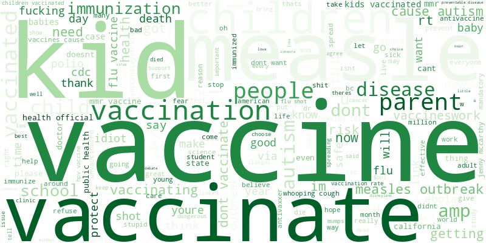
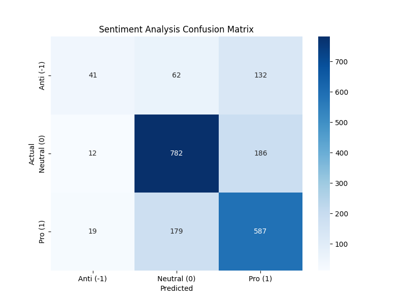

# Vaccination Sentiment Analysis (Zindi Challenge)

## Project Overview
This project was part of Week 4 at **Ngao Labs**. The objective was to develop a Natural Language Processing (NLP) model to classify public sentiment regarding COVID-19 vaccinations. Coming from an Electrical Engineering background, this project served as a deep dive into converting unstructured human language into numerical data for machine learning.

## The Challenge
* **Metric:** Root Mean Squared Error (RMSE)
* **My Result:** 0.57 RMSE
* **The Problem:** Social media text is "noisy" (slang, emojis, sarcasm). Bridging the gap between linguistic nuance and mathematical precision was the primary focus of this week.

## Technical Workflow

### 1. Preprocessing & Tokenization
To handle the "messy" nature of tweets, I implemented a cleaning pipeline:
* Removal of `<user>` and `<url>` tags.
* Filtering punctuation and special characters.
* Lowercasing and whitespace normalization.

### 2. Vectorization (Text to Math)
I used **TF-IDF (Term Frequency-Inverse Document Frequency)** to transform the cleaned tokens into vectors. This allowed the model to weight "important" words (like *safe* or *risk*) more heavily than common stop words.

### 3. Exploratory Data Analysis (EDA)
I generated Word Clouds to visualize the most frequent terms across the three sentiment classes:
* **Pro-Vaccine:** Highlighted words like *protect*, *health*, and *save*.
* **Anti-Vaccine:** Focused on *risk*, *choice*, and *scare*.
* **Neutral:** Mostly news-oriented terms like *cdc*, *study*, and *ebola*.

## Model Performance & Diagnostics
The final model was evaluated using a **Confusion Matrix**. 

**Key Observations:**
* The model performed strongest on the **Neutral** class (as indicated by the dark blue diagonal).
* The **RMSE of 0.57** highlights the difficulty of predicting "soft labels" in human sentiment, where the boundary between Neutral and Pro/Anti can be subjective.

## Lessons Learned
This week solidified my understanding of the NLP pipeline. It taught me that in sentiment analysis, the "cleaning" phase is just as important as the "modeling" phase.

## Tools Used
* Python (Pandas, NumPy, Scikit-Learn)
* Matplotlib & Seaborn
* WordCloud Library
